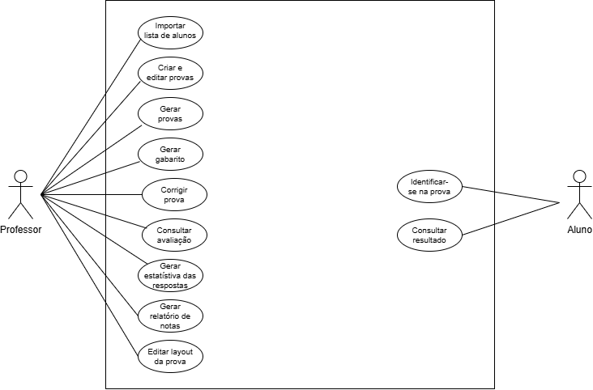
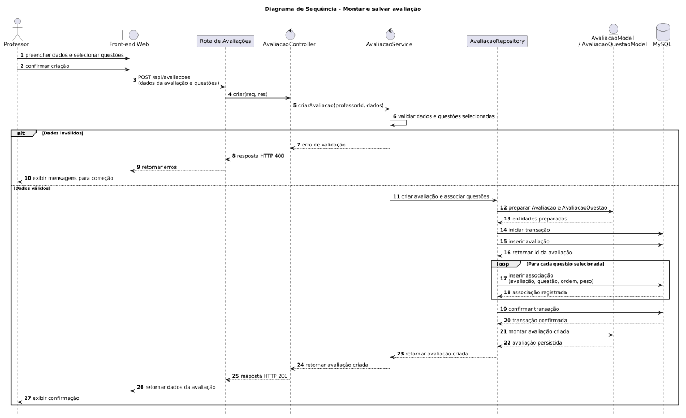

# SGP - Sistema de Geracao de Provas — Guia de Modelagem UML

## 📋 Cenário Base

> *"O cliente (professor) precisa de uma solução para otimizar o tempo gasto na correção de grandes volumes de provas. O sistema deve permitir criar e organizar provas (embaralhando questões e alternativas para evitar cola), gerar folhas de respostas com QR code/gabarito e realizar a correção automatizada através da leitura dessas folhas. Além disso, o sistema deve oferecer relatórios de notas e análises estatísticas sobre o desempenho dos alunos para auxílio pedagógico."*

---

## 1️⃣ Diagrama de Casos de Uso

### 🔎 Passo 1A — Análise do Cenário ("Caça aos Atores e Ações")

**Atores identificados:**

| Ator | Papel no sistema |
|---|---|
| `Professor` | Responsável pela gestão académica de avaliações, desde a importação de alunos, elaboração e correção de exames até à emissão de relatórios e estatísticas. |
| `Aluno` | Responsável por identificar-se e por consultar os seus resultados. |

**Ações / Casos de uso identificados:**

- Importar lista de alunos
- Criar e editar provas 
- Gerar provas
- Gerar gabarito
- Corrigir prova
- Consultar avaliação
- Gerar estatística das respostas 
- Gerar relatório de notas
- Editar layout da prova
- Identificar-se na prova
- Consultar resultado

### 🖼️ Diagrama de Caso de Uso

---

## 2️⃣ Diagrama de Atividades

### 🔎 Passo 2A — Análise do Fluxo Cronológico

Sequência lógica extraída do fluxo:

1. Professor acessa a tela "Corrigir Provas".
2. O sistema carrega as avaliações cadastradas no armazenamento local.
3. **Decisão:** existe avaliação pendente de correção?
   - **[Não]** → Sistema exibe o aviso "Não há provas pendentes para corrigir" (fim).
   - **[Sim]** → Sistema exibe a lista de avaliações (pendente / em correção / corrigida).
4. Professor seleciona uma avaliação ou clica em "Escanear Turma".
5. Sistema exibe a tela de escaneamento (simulada, conforme escopo da N1).
6. Professor clica em "Capturar".
7. Sistema executa `captureScan()`, gerando aluno e nota simulados, e atualiza o status da avaliação para `"em_andamento"`.
8. Sistema exibe o resultado (aluno identificado + nota).
9. **Decisão:** o professor escolhe continuar corrigindo?
   - **[Escanear próxima prova]** → retorna ao passo 6.
   - **[Finalizar turma]** → Sistema executa `finishScanTurma()`, atualizando o status da avaliação para `"concluida"`.
10. Sistema retorna à lista de avaliações (fim).

**Raias identificadas:** o processo envolve apenas dois responsáveis — o Professor, que decide e interage, e o próprio Sistema, que processa e persiste os dados. Por isso o diagrama foi modelado sem raias (swimlanes): com só duas partes, raias não adicionam clareza, e um fluxo linear com pontos de decisão já representa bem o cenário.

| Responsável | Responsabilidades |
|---|---|
| **Professor** | Acessar a tela, selecionar avaliação, clicar em "Escanear Turma"/"Capturar", decidir entre escanear próxima prova ou finalizar turma |
| **Sistema (SGP)** | Carregar avaliações, exibir listas e telas, gerar aluno/nota simulados, atualizar e persistir o status da avaliação |

### 🖼️ Diagrama de Atividades

> 💡 Cada raia (coluna) representa uma nova coluna no diagrama, indicando a transferência de responsabilidade entre os atores/participantes do processo — é essa notação que diferencia um diagrama de atividades "simples" de um diagrama de atividades **com raias**, exigido pela notação UML quando o processo envolve mais de um responsável.

---

## 3️⃣ Diagrama de Classes

### 🔎 Passo 3A — Extração do Texto ("Truque do Detetive")

#### Identificando as classes (substantivos)

| Classe | Descrição |
|---|---|
| **Professor** | Quem cria as questões e monta/gerencia as avaliações |
| **Avaliacao** | O registro central da prova aplicada |
| **Turma** | Quem agrupa os alunos e é vinculada às avaliações aplicadas |
| **Aluno** | Quem é corrigido nas avaliações aplicadas à sua turma |
| **Questao** | Item do banco de questões, reaproveitado na montagem das avaliações |

**Interpretando associações e multiplicidades**

Pergunta-chave: *"Quantos desse podem estar ligados a aquele?"*

- **Professor ↔ Questao:** Um Professor pode criar zero ou várias questões (`0..*`). Uma Questão é criada por um, e somente um, Professor (`1`). → Associação simples `1` — `0..*`.
- **Professor ↔ Avaliacao:** Um Professor pode montar várias avaliações (`0..*`). Uma Avaliação é montada por um, e somente um, Professor (`1`). → Associação simples `1` — `0..*`.
- **Turma ↔ Aluno:** Uma Turma pode possuir vários alunos (`0..*`). Um Aluno pertence a uma, e somente uma, Turma (`1`). → Associação simples `1` — `0..*`.
- **Turma ↔ Avaliacao:** Uma Turma pode ser avaliada em várias avaliações ao longo do tempo (`0..*`). Uma Avaliação é aplicada a uma, e somente uma, Turma (`1`). → Associação simples `1` — `0..*`.
- **Avaliacao ↔ Questao:** Uma Avaliação pode conter várias questões (`0..*`), e uma Questão pode compor várias avaliações diferentes, pois é reaproveitada do banco de questões (`0..*`). → Associação muitos-para-muitos `0..*` — `0..*`.
- **Aluno ↔ Avaliacao:** Um Aluno pode ser corrigido em várias avaliações ao longo do tempo (`0..*`), e uma Avaliação corrige vários alunos (`0..*`). → Associação muitos-para-muitos `0..*` — `0..*`.

### 🖼️ Diagrama de Classes

---

## 4️⃣ Diagrama de Sequência

### 🔎 Passo 4A — Como Analisar e Ler o Diagrama

**Regra de ouro:** leia de cima para baixo; quanto mais abaixo a mensagem aparece, mais tarde ela acontece.

Cenário analisado: **Montar e salvar avaliação no SGP.**

Pré-condição: **o Professor já está autenticado no sistema**. O login não faz parte desta sequência.

1. **Atores e objetos (o elenco):** no topo estão `Professor`, `Front-end Web`, `Rota de Avaliações`, `AvaliacaoController`, `AvaliacaoService`, `AvaliacaoRepository`, `AvaliacaoModel`/`AvaliacaoQuestaoModel` e `MySQL`.
2. **Linhas de vida (o tempo passando):** as linhas tracejadas verticais representam cada participante ao longo da interação.
3. **Mensagens (os diálogos):** as setas contínuas representam solicitações ou chamadas entre participantes; as setas tracejadas representam retornos.
4. **Sequência principal:** o Professor preenche os dados e seleciona questões no Front-end. O Front-end envia a solicitação à API, que encaminha a operação pela rota, controller e service. O service valida os dados e as questões. Com dados válidos, o repository prepara as entidades, inicia uma transação no MySQL, grava a avaliação e associa cada questão selecionada com sua ordem e peso. Após confirmar a transação, o sistema retorna os dados da avaliação criada ao Front-end, que confirma o sucesso ao Professor.
5. **Bloco `alt` (alternativas/decisões):** representa a validação dos dados. Se forem inválidos, a API retorna HTTP 400 e o Front-end apresenta as mensagens para correção. Se forem válidos, a avaliação é persistida e o sistema retorna HTTP 201.
6. **Responsabilidade do Model e do Repository:** o Model representa e prepara as entidades do domínio; o Repository é responsável pelo acesso ao banco de dados. O Model não acessa o MySQL diretamente.

### 🖼️ Diagrama de Sequência

