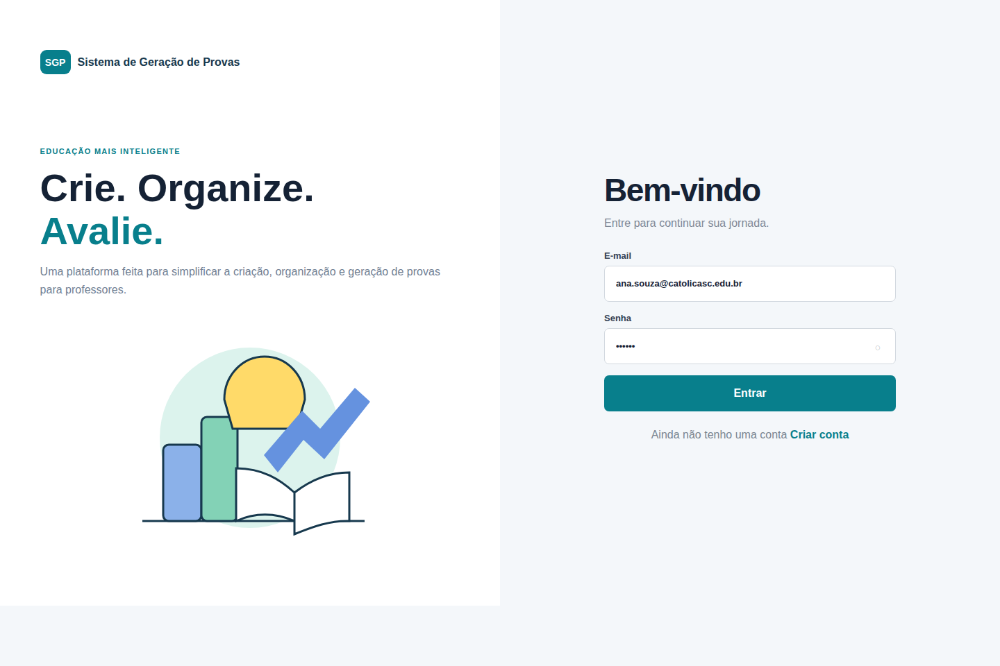

> **Este é o modelo (esqueleto) do README.md do projeto.** Ele mostra os títulos, subtítulos e o que escrever em cada um, com exemplos de como e onde inserir diagramas, prints e links. Copie a estrutura abaixo para o `README.md` do repositório da sua equipe e vá preenchendo e expandindo ao longo do semestre. Não é para entregar este arquivo preenchido com estes textos de exemplo, ele existe só para te mostrar o padrão esperado.
>
> O README evolui em 3 versões, uma por entrega: **v1 na N1**, **v2 na N2** e **final na N3**. Cada seção abaixo tem uma marca (📌 **N1** / 📌 **N2** / 📌 **N3**) indicando a partir de qual entrega ela passa a ser obrigatória. O conteúdo de uma entrega anterior continua no README, só é ajustado se necessário, nunca apagado.

---

## Como usar este modelo

1. Crie a pasta `docs/` na raiz do repositório, com as subpastas `docs/uml/`, `docs/telas/`, `docs/arquitetura/`, `docs/adr/`, `docs/modelo-dados/` e `docs/api/`.
2. Salve cada diagrama, print ou arquivo de apoio na subpasta correspondente.
3. No README, referencie a imagem com a sintaxe ``, assim ela aparece direto na página do repositório, sem precisar abrir outro arquivo.
4. Mantenha o Sumário atualizado conforme for preenchendo as seções.

---

<div align="center">

# 🚀 SGP — Sistema de Geração de Provas

**Plataforma web para professores criarem, aplicarem e corrigirem provas de forma automatizada, com geração de PDF, embaralhamento de questões/alternativas e correção via câmera do smartphone.**

🔗 **Link do sistema hospedado:** https://...


</div>

> 💡 Troque os links dos badges acima se quiser (ex.: apontar a badge de status para "N2" ou "N3" conforme a fase). Eles são só visuais, não afetam o código.

## 👥 Equipe

| Nome completo | Papel / principais frentes no projeto |
|---|---|
| Erick Andrei Demathé | Ex.: Front-end das telas de cadastro, integração com API |
| Gabriel Hoeft Tissi | Ex.: Modelagem de dados, back-end de autenticação |
| Henrique Cezar da Silveira | Ex.: Setup inicial, versionamento, documentação |
| Renan Gabriel Piechontcoski | Ex.: Documentação, testes, apresentação ao cliente |
| Tasciane Negelski Broca | Ex.: Front-end das telas de relatório |

## 📑 Sumário

- [1. Visão Geral](#1-visão-geral)
- [2. Requisitos](#2-requisitos)
  - [2.1 Funcionais (RF)](#21-funcionais-rf)
  - [2.2 Não Funcionais (RNF)](#22-não-funcionais-rnf)
- [3. Modelagem (UML)](#3-modelagem-uml)
- [4. Telas do Sistema](#4-telas-do-sistema)
- [5. Arquitetura de Software](#5-arquitetura-de-software)
- [6. Decisões Arquiteturais (ADRs)](#6-decisões-arquiteturais-adrs)
- [7. Modelo de Dados](#7-modelo-de-dados)
- [8. Stack Tecnológica](#8-stack-tecnológica)
- [9. Estrutura de Pastas](#9-estrutura-de-pastas)
- [10. Como Executar o Projeto](#10-como-executar-o-projeto)
- [11. Especificação da API](#11-especificação-da-api)
- [12. Testes e Validações](#12-testes-e-validações)
- [13. Manual do Usuário](#13-manual-do-usuário)
- [14. Equipe e Contribuições](#14-equipe-e-contribuições)

---

## 1. Visão Geral

📌 **N1**

🎯 **Objetivo:**

Professores com carga horária alta enfrentam um volume grande de provas para corrigir manualmente a cada avaliação (200 a 400 provas por semana de provas), o que consome tempo e atrasa a devolutiva da nota ao aluno. O **SGP (Sistema de Geração de Provas)** resolve esse problema automatizando a criação, a geração e a correção de provas: o professor monta um banco de questões, gera variações embaralhadas da prova em PDF e corrige as folhas de resposta escaneando-as pela câmera do celular direto no navegador, com a nota calculada automaticamente. O sistema é feito para professores e alunos de instituições de ensino que precisam agilizar a correção de avaliações objetivas em turmas grandes.

📌 **Escopo Definido:**
O sistema permite que o professor:
- Monte um banco de questões (enunciado, alternativas e resposta correta);
- Gere avaliações a partir desse banco, separando o caderno de questões da folha de respostas;
- Gere múltiplas variações da mesma prova, com embaralhamento automático de questões e alternativas;
- Gere a folha de respostas em PDF, com marcações de calibração e QR Code identificando a variação;
- Corrija as provas escaneando as folhas de resposta pela câmera do celular, direto no navegador (sem app nativo);
- Consulte relatórios estatísticos por questão e exporte notas e resultados individuais em Excel;
- Exporte o caderno de provas em formato editável (.doc);
- Importe listas de alunos e gere provas individualizadas com o nome impresso na folha de resposta.

**Fora do escopo (por enquanto):** aplicativo mobile nativo — o escaneamento é feito pela interface web responsiva, direto no navegador do celular.

## 2. Requisitos

📌 **N1** (podem ser ajustados nas entregas seguintes, se o escopo mudar)

### 2.1 Funcionais (RF)

| Código | Requisito |
|---|---|
| RF01 | O sistema deve permitir o cadastro e a autenticação (login) de professores. |
| RF02 | O sistema deve permitir a criação e o gerenciamento de um banco de questões (enunciado, alternativas e indicação da resposta correta). |
| RF03 | O sistema deve permitir a montagem de avaliações, separando logicamente o caderno de questões da folha de respostas. |
| RF04 | O sistema deve gerar múltiplas variações da mesma prova, embaralhando automaticamente a ordem das questões e das alternativas. |
| RF05 | O sistema deve permitir a importação de listas de alunos (Excel/CSV) para gerar provas individualizadas (nome impresso na folha de resposta) |
| RF06 | O sistema deve exportar o caderno de provas em formato editável (.doc) para que o professor possa ajustar quebras de página, caso necessário |
| RF07 | O sistema deve gerar a folha de respostas em PDF, contendo marcações de calibração para a câmera e um QR Code único que identifique qual é a variação da prova/aluno. |
| RF08 | O sistema deve acessar a câmera do smartphone pelo navegador (Web App) para escanear as folhas de resposta em lote. |
| RF09 | O sistema deve processar a imagem do gabarito, cruzar com a variação correta da prova e calcular a nota do aluno automaticamente. |
| RF10 | O sistema deve prover uma rota de consulta para que o aluno possa verificar sua nota utilizando o código impresso em sua prova. |
| RF11 | O sistema deve gerar relatórios estatísticos por avaliação, indicando a taxa de acertos e qual alternativa incorreta foi a mais assinalada por questão. |
| RF12 | O sistema deve exportar um relatório final em Excel contendo a nota e detalhando qual alternativa cada aluno marcou em cada questão. |

### 2.2 Não Funcionais (RNF)

Restrições e qualidades do sistema (desempenho, segurança, usabilidade, compatibilidade), não é uma funcionalidade que o usuário aciona diretamente. Exemplo:

| Código | Requisito |
|---|---|
| RNF01 | O back-end deve ser desenvolvido em Node.js com o framework Express. |
| RNF02 | O banco de dados utilizado deve ser o MySQL. |
| RNF03 | A aplicação deve respeitar estritamente a arquitetura em camadas: Rota → Controle → Serviço → Repositório → Model. |
| RNF04 | A interface de usuário web deve ser responsiva, minimalista e focar na usabilidade (poucos cliques para as tarefas principais). |
| RNF05 | O escaneamento (correção das provas) deve ser executado no próprio navegador do celular, sem a necessidade de um aplicativo mobile. |
| RNF06 | As senhas dos usuários devem ser armazenadas de forma segura utilizando criptografia. |

## 3. Modelagem (UML)

📌 **N2**

Diagrama de casos de uso, diagrama de classes e diagrama de atividades do sistema (e demais diagramas que forem necessários). Exporte cada diagrama como imagem (PNG ou SVG) e salve em `docs/uml/`, depois insira aqui:

```


```

Abaixo de cada imagem, escreva um parágrafo curto explicando o que o diagrama representa.

## 4. Telas do Sistema

📌 **N1**

Prints das telas principais, na ordem do fluxo de navegação (a tela A leva à tela B), salvos em `docs/telas/`. Insira as imagens e, embaixo de cada uma, uma legenda de uma linha dizendo o que ela faz:

```

*Tela de login: autenticação do usuário por e-mail e senha.*
```

## 5. Arquitetura de Software

📌 **N3** (pode ser esboçada antes, mas passa a ser obrigatória na entrega final)

Estilo em camadas usado no projeto: `rota → controle → serviço → repositório → model`. Explique, em poucas linhas, a responsabilidade de cada camada (o que ela pode e não pode fazer) e como uma requisição passa por elas até chegar no banco de dados e voltar como resposta.

Insira aqui o **desenho da arquitetura** (diagrama de componentes/camadas), exportado como imagem e salvo em `docs/arquitetura/`:

```

```

## 6. Decisões Arquiteturais (ADRs)

📌 **N2** (primeiras decisões, como a escolha do banco e da estrutura de camadas) e **N3** (registro completo)

Um ADR (*Architecture Decision Record*) documenta uma decisão técnica importante: o que foi decidido, por quê, e quais as consequências. Crie um arquivo por decisão em `docs/adr/`, numerado (`ADR-001-nome-da-decisao.md`, `ADR-002-...`), seguindo este modelo mínimo dentro de cada arquivo:

```
# ADR-001: Título curto da decisão

## Contexto
Qual problema ou dúvida técnica motivou essa decisão.

## Decisão
O que a equipe decidiu fazer.

## Consequências
O que essa escolha facilita, o que ela custa ou limita.
```

Aqui no README, liste os ADRs (Registros de Decisão Arquitetural) criados (se necessário e houver), com link para cada arquivo:

- [ADR-001: Título da decisão](docs/adr/ADR-001-titulo-da-decisao.md)
- [ADR-002: Título da decisão](docs/adr/ADR-002-titulo-da-decisao.md)

## 7. Modelo de Dados

📌 **N2**

Diagrama MER/DER do banco de dados, exportado como imagem e salvo em `docs/modelo-dados/`:

```

```

Em seguida, o dicionário de dados: uma tabela por entidade, com os campos, tipos e uma breve descrição.

| Campo | Tipo | Descrição |
|---|---|---|
| id | INT (PK) | Identificador único do registro |
| nome | VARCHAR(120) | Nome do usuário |

## 8. Stack Tecnológica

📌 **N1** (lista inicial, pode crescer nas entregas seguintes)

Tecnologias usadas no projeto e por que cada uma foi escolhida. A stack obrigatória da disciplina é:


- **Node.js**: ambiente de execução do back-end.
- **Express**: framework para as rotas e a API REST.
- **MySQL**: banco de dados relacional.

Se a equipe usar outras bibliotecas relevantes (ex.: JWT para autenticação, bcrypt para senhas, dotenv para variáveis de ambiente), liste aqui também, com uma linha dizendo para que serve cada uma.

## 9. Estrutura de Pastas

📌 **N1**, atualizada conforme o projeto cresce

```
src/
  routes/        # define os endpoints e direciona para os controllers
  controllers/    # recebe a requisição, valida e chama o service
  services/       # regras de negócio
  repositories/   # acesso ao banco de dados
  models/         # representação das entidades
docs/
  uml/
  telas/
  arquitetura/
  adr/
  modelo-dados/
  api/
```

## 10. Como Executar o Projeto

📌 **N1**, revisado a cada entrega

Passo a passo para clonar e rodar o projeto localmente, incluindo as versões usadas (ex.: Node 20.x):

```
1. git clone https://github.com/Erickdemathe123/projeto-arquitetura-.git
2. cd projeto-arquitetura-
3. npm install
4. copiar .env.example para .env e configurar as variáveis (ex.: dados de acesso ao MySQL)
5. npm run dev
```

## 11. Especificação da API

📌 **N2**

Tabela com os principais endpoints da API. Se a lista crescer muito, mova para um arquivo separado (ex.: `docs/api/especificacao.md`) ou uma coleção do Postman/Insomnia exportada em `docs/api/`, e deixe aqui só o link.

| Método | Rota | Descrição |
|---|---|---|
| GET | /api/recurso | Lista os recursos |
| POST | /api/recurso | Cria um novo recurso |
| PUT | /api/recurso/:id | Atualiza um recurso existente |
| DELETE | /api/recurso/:id | Remove um recurso |

## 12. Testes e Validações

📌 **N3** (validações e tratamento de erros/casos de borda passam a ser cobrados nesta entrega)

Como testar os endpoints principais: descreva o passo a passo ou aponte para a coleção do Postman/Insomnia salva em `docs/api/`. Descreva também as validações e o tratamento de erros e casos de borda implementados (ex.: campo obrigatório vazio, e-mail duplicado, item inexistente), e como o sistema responde em cada caso.

## 13. Manual do Usuário

📌 **N3**

Guia rápido de como usar o sistema, do ponto de vista de quem vai operá-lo (o cliente), não do desenvolvedor: passo a passo das principais funcionalidades, com prints. Pode ficar em um arquivo separado, `docs/manual-usuario.md`, com o link a partir daqui:

📘 [Manual do Usuário](docs/manual-usuario.md)

## 14. Equipe e Contribuições

📌 **N1**, mantido até a N3

Nome: principais contribuições no projeto (ex.: telas de cadastro, integração com banco, documentação). Serve para deixar claro quem fez o quê na entrega da equipe; não substitui o diário de organização de tarefas individual de cada pessoa.

- **Erick Andrei Demathé**: principais contribuições.
- **Gabriel Hoeft Tissi**: principais contribuições.
- **Henrique Cezar da Silveira**: principais contribuições.
- **Renan Gabriel Piechontcoski**: principais contribuições.
- **Tasciane Negelski Broca**: principais contribuições.

---

<div align="center">

*README elaborado para a disciplina de Projeto e Arquitetura de Software*

</div>
