<div align="center">

# SGP — Sistema de Geração de Provas

**Plataforma web em desenvolvimento para professores organizarem turmas, criarem questões e montarem avaliações.**

🔗 **Link do sistema hospedado:** https://projeto-arquitetura-iota.vercel.app/

> **Estado do projeto (N3):** login/cadastro, turmas e alunos (importação por CSV e Excel), banco de questões, avaliações com pontos por questão, versões embaralhadas, caderno em PDF e Word, folha de respostas com QR Code, provas individualizadas por aluno, correção pela câmera do celular com cálculo automático da nota, folha avulsa, estatísticas por avaliação e consulta do aluno com acertos por questão são persistidos pela API Express no MySQL. O teste de correção com folhas reais em Android e iPhone (T63) segue o roteiro de [docs/teste-camera-t63.md](docs/teste-camera-t63.md).


</div>

## 👥 Equipe

| Nome completo | Papel / principais frentes no projeto |
|---|---|
| Erick Andrei Demathé | Diagramas UML (classes), Modelagem MER/DER (MySQL), API de provas e de aplicação |
| Gabriel Hoeft Tissi | Revisa/Entrega UML, Script SQL (DDL/Seed), API de questões, Testes e-2-e no ambiente hospedado, Empacotamento de entrega |
| Henrique Cezar da Silveira | Setup inicial, Front-end, Versionamento, Documentação, API (autenticação JWT e validações/tratamento de erros), Desição Arquitetural, Diagrama UML (sequência), Hospedagem (front-end, back-end e banco na nuvem), Revisão e merge de PRs |
| Renan Gabriel Piechontcoski | Diagramas UML (atividades), Dicionário de dados, Integração front-end (provas e aplicações), Remoção de mocks |
| Tasciane Negelski Broca | Diagramas UML (casos de uso), API de turmas e importação de alunos por CSV e Excel, integração das turmas no front-end, estatísticas da avaliação, consulta do aluno por questão, README v2 e v3 |

## 📑 Sumário

- [1. Visão Geral](#1-visão-geral)
- [2. Requisitos](#2-requisitos)
  - [2.1 Funcionais (RF)](#21-funcionais-rf)
  - [2.2 Não Funcionais (RNF)](#22-não-funcionais-rnf)
- [3. Modelagem (UML)](#3-modelagem-uml)
- [4. Telas do Sistema](#4-telas-do-sistema)
- [5. Arquitetura de Software](#5-arquitetura-de-software)
- [6. Decisões Arquiteturais (ADRs)](#6-decisões-arquiteturais-adrs)
- [7. Modelo de Dados](#7-modelo-de-dados)
- [8. Stack Tecnológica](#8-stack-tecnológica)
- [9. Estrutura de Pastas](#9-estrutura-de-pastas)
- [10. Como Executar o Projeto](#10-como-executar-o-projeto)
- [11. Especificação da API](#11-especificação-da-api)
- [12. Testes e Validações](#12-testes-e-validações)
- [13. Manual do Usuário](#13-manual-do-usuário)
- [14. Equipe e Contribuições](#14-equipe-e-contribuições)

---

## 1. Visão Geral

Professores com carga horária alta enfrentam um volume grande de provas para corrigir manualmente a cada avaliação (200 a 400 provas por semana de provas), o que consome tempo e atrasa a devolutiva da nota ao aluno. O **SGP (Sistema de Geração de Provas)** resolve esse problema automatizando a criação, a geração e a correção de provas: o professor monta um banco de questões, gera variações embaralhadas da prova em PDF e corrige as folhas de resposta escaneando-as pela câmera do celular direto no navegador, com a nota calculada automaticamente. O sistema é feito para professores e alunos de instituições de ensino que precisam agilizar a correção de avaliações objetivas em turmas grandes.

## 2. Requisitos

### 2.1 Funcionais (RF)

| Código | Requisito |
|---|---|
| RF01 | O sistema deve permitir o cadastro e a autenticação (login) de professores. |
| RF02 | O sistema deve permitir a criação e o gerenciamento de um banco de questões (enunciado, alternativas e indicação da resposta correta). |
| RF03 | O sistema deve permitir a montagem de avaliações, separando logicamente o caderno de questões da folha de respostas. |
| RF04 | O sistema deve gerar múltiplas variações da mesma prova, embaralhando automaticamente a ordem das questões e das alternativas. |
| RF05 | O sistema deve permitir a importação de listas de alunos (Excel/CSV) para gerar provas individualizadas (nome impresso na folha de resposta) |
| RF06 | O sistema deve exportar o caderno de provas em formato editável (.doc) para que o professor possa ajustar quebras de página, caso necessário |
| RF07 | O sistema deve gerar a folha de respostas em PDF, contendo marcações de calibração para a câmera e um QR Code único que identifique qual é a variação da prova/aluno. |
| RF08 | O sistema deve acessar a câmera do smartphone pelo navegador (Web App) para escanear as folhas de resposta em lote. |
| RF09 | O sistema deve processar a imagem do gabarito, cruzar com a variação correta da prova e calcular a nota do aluno automaticamente. |
| RF10 | O sistema deve prover uma rota de consulta para que o aluno possa verificar sua nota utilizando o código impresso em sua prova. |
| RF11 | O sistema deve gerar relatórios estatísticos por avaliação, indicando a taxa de acertos e qual alternativa incorreta foi a mais assinalada por questão. |
| RF12 | O sistema deve exportar um relatório final em Excel contendo a nota e detalhando qual alternativa cada aluno marcou em cada questão. |
| RF13 | O sistema deve permitir a geração de uma folha de respostas avulsa em PDF, com QR Code, para avaliações elaboradas externamente, permitindo ao professor informar o gabarito para correção automática. |

### 2.2 Não Funcionais (RNF)

| Código | Requisito |
|---|---|
| RNF01 | O back-end deve ser desenvolvido em Node.js com o framework Express. |
| RNF02 | O banco de dados utilizado deve ser o MySQL. |
| RNF03 | A aplicação deve respeitar estritamente a arquitetura em camadas: Rota → Controle → Serviço → Repositório → Model. |
| RNF04 | A interface de usuário web deve ser responsiva, minimalista e focar na usabilidade (poucos cliques para as tarefas principais). |
| RNF05 | O escaneamento (correção das provas) deve ser executado no próprio navegador do celular, sem a necessidade de um aplicativo mobile. |
| RNF06 | As senhas dos usuários devem ser armazenadas de forma segura utilizando criptografia. |
| RNF07 | O caderno de questões gerado em PDF e DOCX não deve dividir uma questão entre duas páginas. |
| RNF08 | O processamento de cada folha de respostas deve ocorrer em até 5 segundos, permitindo corrigir uma turma de 50 alunos em menos de 30 minutos. |
| RNF09 | O sistema deve possuir validações, tratamento de erros e testes dos casos de borda nas rotas e interfaces. |
| RNF10 | O sistema hospedado deve estar disponível durante a entrega e apresentação do projeto. |
| RNF11 | O sistema deve garantir a segurança e privacidade dos dados, utilizando senhas com no mínimo oito caracteres, QR Codes opacos para provas individualizadas e limite de tentativas de acesso. |

## 3. Modelagem (UML)

Diagramas atualizados para o sistema final (T67). Os fontes PlantUML (`.puml`) ficam ao lado dos PNGs em `docs/uml/`.

### Diagrama de Classes

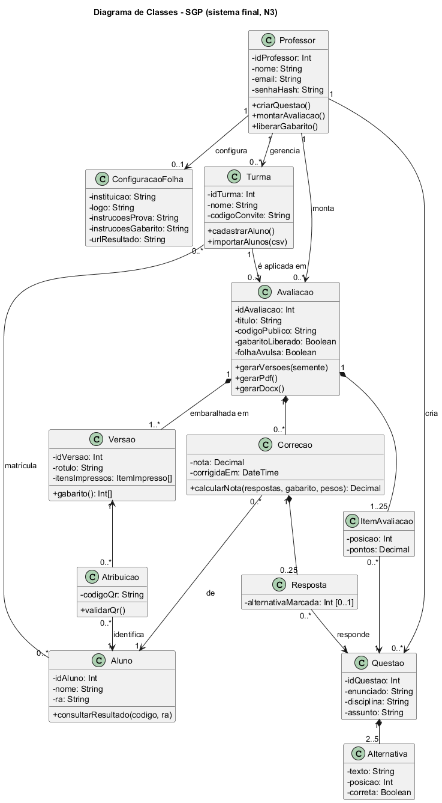

Representa as entidades do domínio do SGP no sistema final. O `Professor` cria `Questao` (cada uma com 2 a 5 `Alternativa`), gerencia `Turma` (com matrícula de `Aluno`), guarda a `ConfiguracaoFolha` (instituição, logo e instruções) e monta `Avaliacao`. A avaliação tem até 25 `ItemAvaliacao` (questão + pontos) e é embaralhada em uma ou mais `Versao`, cada uma com a ordem impressa e o gabarito. A `Atribuicao` liga um aluno a uma versão por meio do código opaco do QR. Na correção, cada `Correcao` guarda a nota do aluno e as `Resposta` marcadas por questão. Correspondência com o banco: `exam_versions`, `exam_assignments`, `results` e `result_answers`.

### Diagrama de Atividades — Corrigir Provas

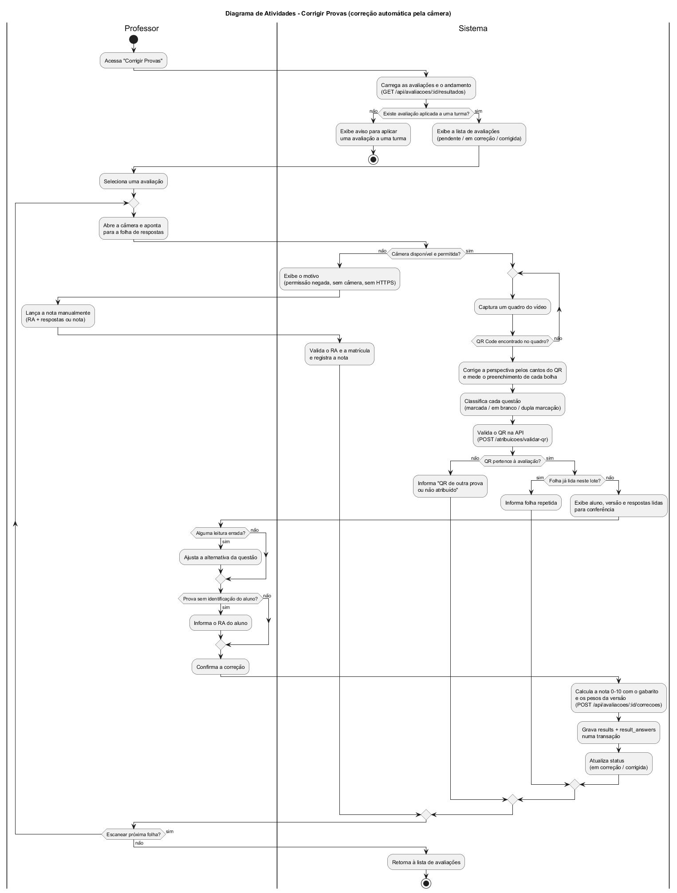

Substitui o fluxo simulado da N1/N2 pela correção automática pela câmera. O diagrama tem duas raias: **Professor**, que aponta a câmera, confere e confirma, e **Sistema**, que lê o QR e as bolhas, valida e calcula a nota.

1. O professor acessa **Corrigir Provas** e o sistema carrega as avaliações com o andamento da correção. Se nenhuma avaliação foi aplicada a uma turma, o sistema exibe um aviso e o fluxo termina.
2. O professor seleciona a avaliação e abre a câmera. Se a câmera não estiver disponível (permissão negada, aparelho sem câmera ou página sem HTTPS), o sistema mostra o motivo e o professor lança a nota manualmente.
3. O sistema captura quadros do vídeo até encontrar um QR Code. Depois corrige a perspectiva pelos cantos do QR, mede o preenchimento de cada bolha e classifica cada questão como marcada, em branco ou com dupla marcação.
4. O sistema valida o QR na API. Um QR de outra prova, não atribuído ou já lido no lote é recusado sem gerar nota.
5. Com o QR válido, o professor confere o aluno, a versão e as respostas lidas, ajusta alguma leitura se precisar, informa o RA se a prova não tiver identificação e confirma.
6. O sistema calcula a nota de 0 a 10 com o gabarito e os pesos da versão, grava `results` e `result_answers` numa transação e atualiza o status da avaliação. O laço se repete para a próxima folha.

### Diagrama de Casos de Uso

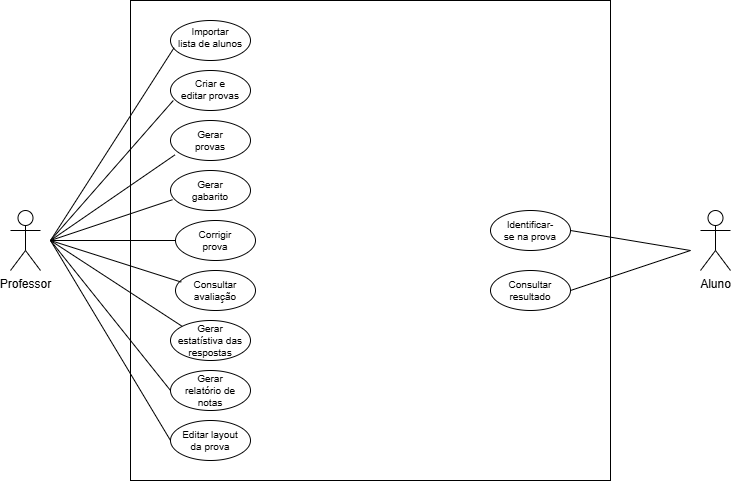

Mostra os dois atores externos do SGP e o que cada um faz no sistema. O **Professor** importa a lista de alunos, cria e edita provas, gera as provas e o gabarito, corrige as provas, consulta as avaliações, gera as estatísticas das respostas e o relatório de notas e edita o layout da prova. O **Aluno** se identifica na prova e consulta o seu resultado.

A análise do cenário, a lista de atores e casos de uso e o passo a passo da criação estão em [N2-P1.md](N2-P1.md).

### Diagrama de Sequencia

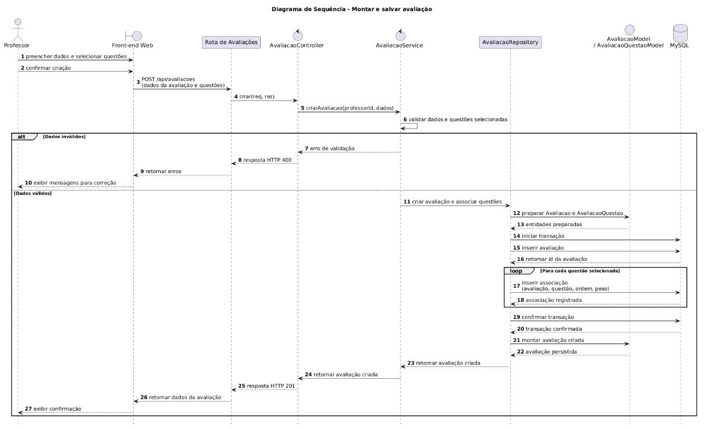

O diagrama representa o fluxo de criação e persistência de uma avaliação. O professor preenche os dados e seleciona as questões no front-end, que envia a solicitação à rota da API. A requisição passa pelo controller e pelo service, responsável por validar as informações e as questões selecionadas.

Se os dados forem inválidos, a API retorna HTTP 400 e o front-end apresenta mensagens para correção. Se forem válidos, o repository prepara a avaliação e suas associações com as questões e inicia uma transação no MySQL. A avaliação é inserida e cada questão selecionada é associada à prova com sua ordem e peso. Após a confirmação da transação, os dados da avaliação criada retornam pelas camadas até o front-end, que confirma o sucesso ao professor.

### Diagrama de Sequência — Correção automática pela câmera

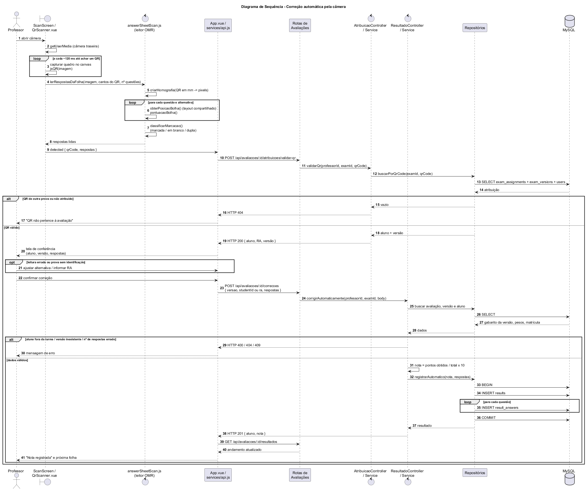

Mostra a correção de uma folha de ponta a ponta. A leitura acontece toda no navegador (RNF05). O `QrScanner.vue` lê o QR com o jsQR, e o `answerSheetScan.js` usa os cantos do QR e as coordenadas em mm do layout compartilhado (`shared/folhaRespostasLayout.js`) para localizar e medir cada bolha. O front-end valida o QR em `POST /api/avaliacoes/:id/atribuicoes/validar-qr`. A API responde 404 para QR de outra prova; para QR válido, devolve o aluno e a versão para a tela de conferência. Depois da confirmação, `POST /api/avaliacoes/:id/correcoes` calcula a nota com o gabarito e os pesos da versão e grava `results` e `result_answers` numa única transação. Aluno fora da turma, versão inexistente ou número errado de respostas resultam em HTTP 400/404/409.

## 4. Telas do Sistema

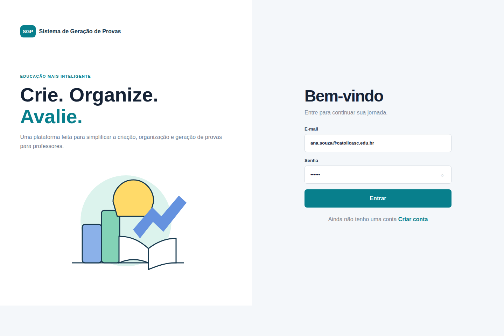
*Tela de login: autenticação do usuário por e-mail e senha, com opção de criar conta.*

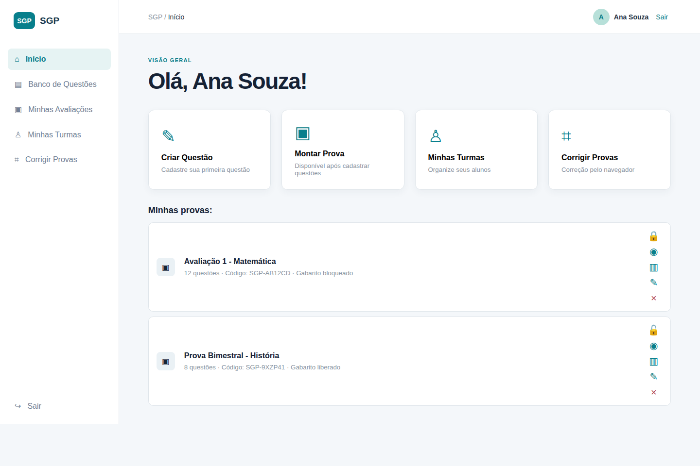
*Início: visão geral do professor, com atalhos para as principais ações e a lista de provas já criadas.*

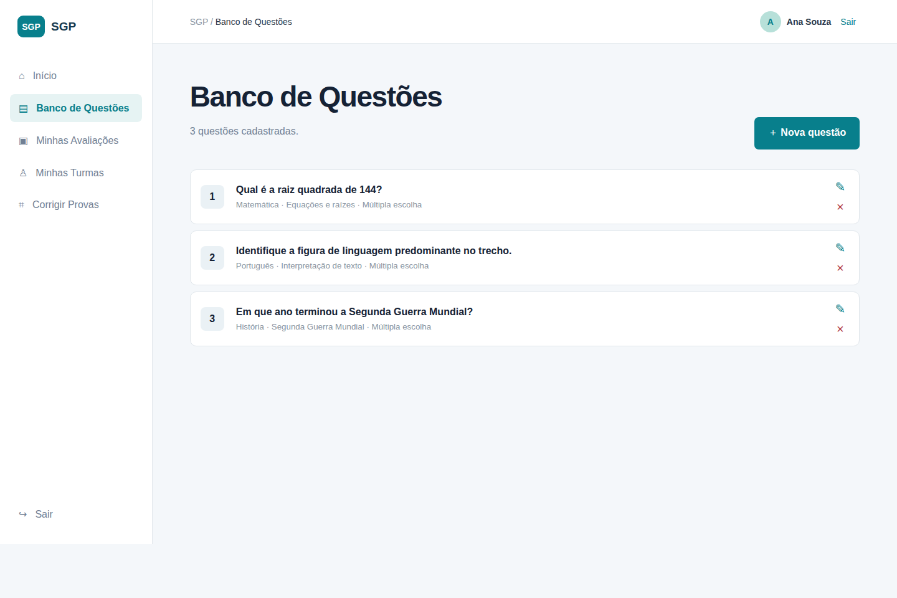
*Banco de Questões: lista as questões cadastradas, com opções de editar e remover.*

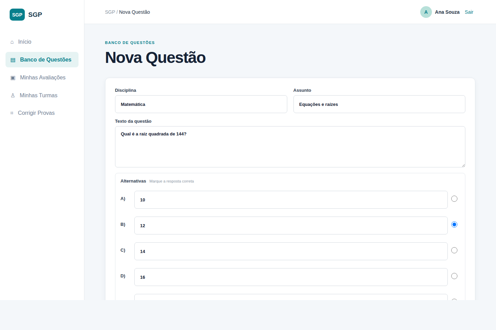
*Nova Questão: cadastro de uma questão de múltipla escolha, com disciplina, assunto, alternativas e marcação da resposta correta.*

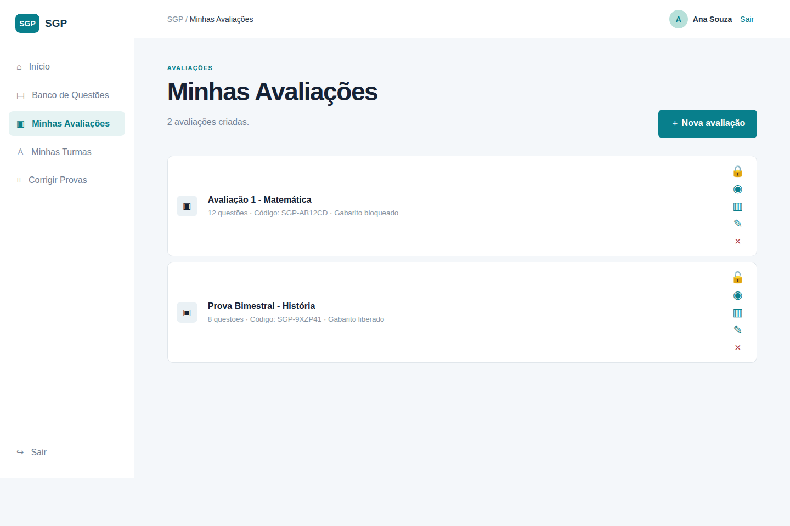
*Minhas Avaliações: lista as provas montadas, com o código público, o status do gabarito e ações de pré-visualizar, ver estatísticas, editar e remover.*

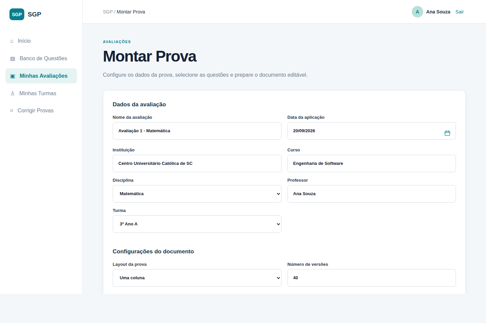
*Montar Prova: configuração dos dados da avaliação (instituição, disciplina, turma, layout) e seleção das questões do banco que vão compor a prova.*

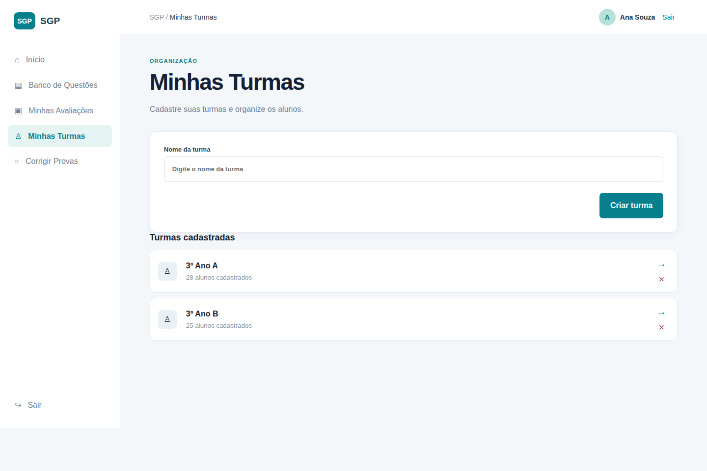
*Minhas Turmas: cadastro das turmas do professor, com a contagem de alunos de cada uma.*

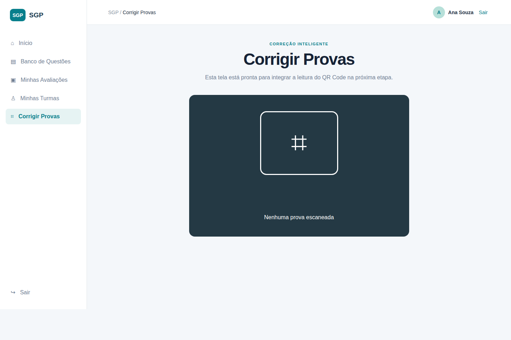
*Corrigir Provas: tela reservada para a leitura das folhas de resposta pela câmera, a ser integrada nas próximas entregas.*

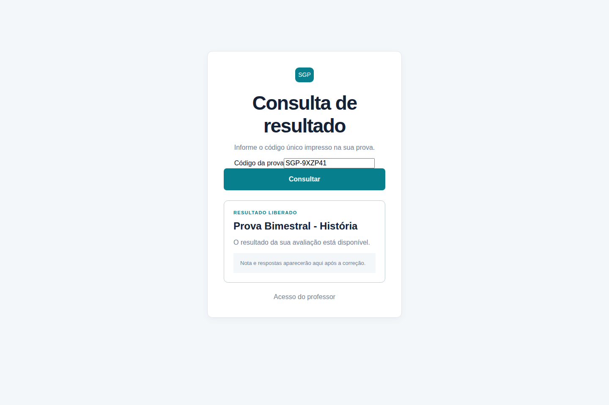
*Consulta do aluno: portal público onde o aluno informa o código da prova para ver se o resultado já foi liberado pelo professor.*

## 5. Arquitetura de Software

O back-end segue o estilo em camadas `rota → controle → serviço → repositório → model` (ADR-001). Cada camada só conversa com a seguinte:

| Camada | Pasta | Responsabilidade | O que não faz |
|---|---|---|---|
| Rota | `src/routes/` | Liga método + endereço ao controller e aplica os middlewares (login, perfil de professor, validação do `:id`, limite de tentativas). | Não tem regra de negócio. |
| Controle | `src/controllers/` | Lê a requisição (parâmetros, corpo, usuário do token), chama o serviço e devolve o status HTTP e o JSON. | Não acessa o banco nem decide regras. |
| Serviço | `src/services/` | Regras de negócio e validações (ex.: aluno precisa estar na turma, nota de 0 a 10, não regerar versões depois da correção). Lança `ErroDeNegocio` com o status adequado. | Não escreve SQL. |
| Repositório | `src/repositories/` | Único ponto que fala com o MySQL, com consultas parametrizadas e transações (ex.: nota e respostas gravadas juntas). | Não conhece HTTP. |
| Model | `src/models/` | Converte as linhas do banco em objetos da aplicação. | Não tem regra nem acesso a dados. |

Uma requisição entra pelo Express (`src/app.js`), passa pelos middlewares (JWT, perfil, validação), chega à rota, ao controller e ao serviço, que usa o repositório para consultar ou gravar no MySQL. O resultado volta pelo mesmo caminho e o `errorHandler` converte qualquer erro em `{ "erro": "mensagem" }` com o status correto. Utilitários de geração de arquivos (`src/utils/`: PDF do caderno e da folha, `.docx`, embaralhamento com semente) são chamados pelos serviços. O layout da folha de respostas em mm fica em `shared/folhaRespostasLayout.js`, usado pelo gerador de PDF e pelo leitor de marcações do navegador.

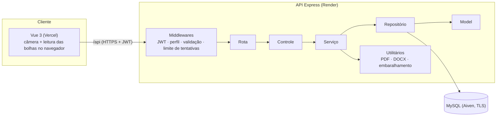
```mermaid
flowchart LR
  subgraph Cliente
    UI["Vue 3 (Vercel)<br/>câmera + leitura das bolhas no navegador"]
  end
  subgraph API["API Express (Render)"]
    MW["Middlewares<br/>JWT · perfil · validação · limite de tentativas"]
    R["Rota"] --> C["Controle"] --> S["Serviço"] --> RE["Repositório"] --> M["Model"]
    S --> U["Utilitários<br/>PDF · DOCX · embaralhamento"]
  end
  DB[("MySQL (Aiven, TLS)")]
  UI -- "/api (HTTPS + JWT)" --> MW --> R
  RE --> DB
```

## 6. Decisões Arquiteturais (ADRs)

Um ADR (*Architecture Decision Record*) registra uma decisão técnica relevante,
incluindo o contexto que a motivou, a escolha adotada e suas consequências.
Os registros abaixo documentam as decisões que orientam a arquitetura e a
integração atual do SGP. A arquitetura em camadas e a stack Node.js, Express,
MySQL e Vue.js são restrições da disciplina; os ADRs registram como o projeto
as aplica e as decisões complementares tomadas pela equipe.

| ADR | Decisão | Situação |
|---|---|---|
| [ADR-001](docs/adr/ADR-001-arquitetura-em-camadas.md) | Organizar o back-end em camadas com responsabilidades separadas | Adotada |
| [ADR-002](docs/adr/ADR-002-mysql-relacional.md) | Usar MySQL como persistência relacional do sistema | Adotada |
| [ADR-003](docs/adr/ADR-003-autenticacao-jwt-bcrypt.md) | Autenticar usuários com JWT e armazenar senhas com bcrypt | Adotada |
| [ADR-004](docs/adr/ADR-004-hospedagem-em-nuvem.md) | Hospedar front-end, API e banco em serviços separados, com TLS no banco | Adotada |
| [ADR-005](docs/adr/ADR-005-dados-de-prototipo.md) | Não migrar dados de domínio do protótipo local para o banco | Adotada |

## 7. Modelo de Dados

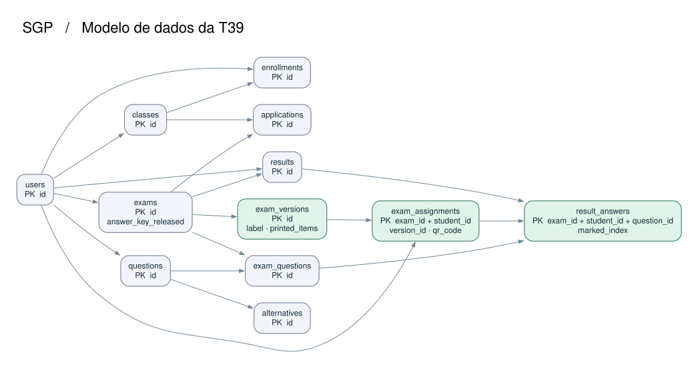

O [dicionário e contrato da T39](docs/modelo-dados/t39.md) descreve as tabelas de versões, atribuições e respostas e a migração do banco N2. [Diagrama anterior da N2](docs/modelo-dados/mer-der.png).

### Dicionário de Dados

#### `users`: professores e alunos

| Campo | Tipo | Descrição |
|---|---|---|
| id | BIGINT UNSIGNED (PK) | Identificador único, gerado automaticamente |
| name | VARCHAR(120) NOT NULL | Nome do usuário |
| email | VARCHAR(160) (UK), NULL | E-mail; único quando informado e obrigatório para professores |
| password_hash | VARCHAR(255), NULL | Hash bcrypt da senha; obrigatório para professores |
| role | VARCHAR(9) NOT NULL | Papel do usuário: `professor` ou `aluno` |
| ra | VARCHAR(30) (UK), NULL | Registro acadêmico do aluno; único quando informado |
| created_at | TIMESTAMP, DEFAULT CURRENT_TIMESTAMP | Data e hora de criação do registro |

A restrição `CHECK` limita `role` a `professor` ou `aluno`. Outra restrição exige
`email` e `password_hash` quando o papel é `professor`. A chave única composta
`(id, role)` permite que outras tabelas referenciem simultaneamente o usuário e seu papel.

#### `classes`: turmas

| Campo | Tipo | Descrição |
|---|---|---|
| id | BIGINT UNSIGNED (PK) | Identificador único, gerado automaticamente |
| name | VARCHAR(120) NOT NULL | Nome da turma |
| invite_code | CHAR(8) (UK) NOT NULL | Código único de convite para ingresso na turma |
| teacher_id | BIGINT UNSIGNED (FK composta → `users.id`) NOT NULL | Identificador do professor responsável |
| teacher_role | VARCHAR(9) NOT NULL, DEFAULT `professor` | Campo técnico da FK composta; o `CHECK` exige o papel `professor` |
| description | VARCHAR(255), NULL | Descrição opcional da turma |
| archived | BOOLEAN NOT NULL, DEFAULT `FALSE` | Indica se a turma está arquivada |
| created_at | TIMESTAMP, DEFAULT CURRENT_TIMESTAMP | Data e hora de criação |
| updated_at | TIMESTAMP, DEFAULT CURRENT_TIMESTAMP, ON UPDATE CURRENT_TIMESTAMP | Data e hora da última atualização; atualizada automaticamente pelo MySQL |

A FK composta `(teacher_id, teacher_role)` referencia `(users.id, users.role)`,
impedindo que um aluno seja definido como professor responsável. A chave única
`(id, teacher_id)` é usada por outras tabelas para validar o professor proprietário.

#### `enrollments`: matrículas (aluno × turma)

| Campo | Tipo | Descrição |
|---|---|---|
| id | BIGINT UNSIGNED (PK) | Identificador único, gerado automaticamente |
| class_id | BIGINT UNSIGNED (FK → `classes.id`) NOT NULL | Turma da matrícula; ao excluir a turma, a matrícula também é excluída |
| student_id | BIGINT UNSIGNED (FK composta → `users.id`) NOT NULL | Aluno matriculado |
| student_role | VARCHAR(9) NOT NULL, DEFAULT `aluno` | Campo técnico da FK composta; o `CHECK` exige o papel `aluno` |
| enrolled_at | DATETIME NOT NULL, DEFAULT CURRENT_TIMESTAMP | Data e hora da matrícula |

As FKs `(student_id, student_role)` → `(users.id, users.role)` asseguram que a matrícula
seja de um aluno. A restrição `UNIQUE (class_id, student_id)` impede que o mesmo aluno
se matricule mais de uma vez na mesma turma.

#### `questions`: banco de questões

| Campo | Tipo | Descrição |
|---|---|---|
| id | BIGINT UNSIGNED (PK) | Identificador único, gerado automaticamente |
| statement | TEXT NOT NULL | Enunciado da questão |
| teacher_id | BIGINT UNSIGNED (FK composta → `users.id`) NOT NULL | Professor autor da questão |
| teacher_role | VARCHAR(9) NOT NULL, DEFAULT `professor` | Campo técnico da FK composta; o `CHECK` exige o papel `professor` |
| subject | VARCHAR(120), NULL | Disciplina relacionada à questão |
| topic | VARCHAR(120), NULL | Assunto ou tópico relacionado à questão |
| created_at | TIMESTAMP, DEFAULT CURRENT_TIMESTAMP | Data e hora de criação |
| updated_at | TIMESTAMP, DEFAULT CURRENT_TIMESTAMP, ON UPDATE CURRENT_TIMESTAMP | Data e hora da última atualização; atualizada automaticamente pelo MySQL |

A FK composta `(teacher_id, teacher_role)` → `(users.id, users.role)` assegura que o
autor seja um professor. A chave única `(id, teacher_id)` permite verificar a propriedade
da questão em `exam_questions`.

#### `alternatives`: alternativas de cada questão

| Campo | Tipo | Descrição |
|---|---|---|
| id | BIGINT UNSIGNED (PK) | Identificador único, gerado automaticamente |
| question_id | BIGINT UNSIGNED (FK → `questions.id`) NOT NULL | Questão à qual a alternativa pertence; a exclusão da questão remove suas alternativas |
| text | VARCHAR(255) NOT NULL | Texto da alternativa |
| is_correct | BOOLEAN NOT NULL | Indica se a alternativa é a resposta correta (`TRUE`/`1`) |
| position | TINYINT UNSIGNED NOT NULL | Posição da alternativa, de `0` a `4` (A a E), única por questão |
| correct_marker | TINYINT gerado | Coluna calculada: recebe `1` para alternativas corretas e `NULL` para as demais; índice único permite no máximo uma correta por questão |

O banco valida que `position` esteja entre `0` e `4` e que `is_correct` seja `0` ou `1`.
O limite de duas a cinco alternativas e a exigência de exatamente uma correta são
validados pela API; o índice técnico no banco impede duas respostas corretas na mesma questão.

#### `exams`: provas

| Campo | Tipo | Descrição |
|---|---|---|
| id | BIGINT UNSIGNED (PK) | Identificador único, gerado automaticamente |
| title | VARCHAR(120) NOT NULL | Título da prova |
| status | ENUM(`draft`, `ready`, `closed`) NOT NULL, DEFAULT `draft` | Estado: rascunho, pronta/aplicada ou encerrada |
| teacher_id | BIGINT UNSIGNED (FK composta → `users.id`) NOT NULL | Professor responsável pela prova |
| teacher_role | VARCHAR(9) NOT NULL, DEFAULT `professor` | Campo técnico da FK composta; o `CHECK` exige o papel `professor` |
| public_code | VARCHAR(20) (UK), NULL | Código público opcional e único para consulta da prova |
| legacy_details | JSON, NULL | Metadados da avaliação herdados da versão N1 |
| created_at | TIMESTAMP, DEFAULT CURRENT_TIMESTAMP | Data e hora de criação |

A FK composta `(teacher_id, teacher_role)` → `(users.id, users.role)` assegura que o
responsável seja um professor. A chave única `(id, teacher_id)` é usada para validar
a propriedade da prova nas tabelas relacionadas.

#### `exam_questions`: questões de cada prova

| Campo | Tipo | Descrição |
|---|---|---|
| id | BIGINT UNSIGNED (PK) | Identificador único do item, gerado automaticamente |
| exam_id | BIGINT UNSIGNED (FK composta → `exams.id`) NOT NULL | Prova que contém a questão; ao excluir a prova, o item também é excluído |
| question_id | BIGINT UNSIGNED (FK composta → `questions.id`) NOT NULL | Questão incluída na prova |
| teacher_id | BIGINT UNSIGNED (FK composta) NOT NULL | Identificador técnico usado nas FKs para validar a propriedade comum |
| points | DECIMAL(6,2) NOT NULL, DEFAULT `1.00` | Pontuação atribuída à questão; deve ser maior que zero |
| position | INT UNSIGNED NOT NULL | Ordem da questão na prova; única dentro da mesma prova |

As FKs `(exam_id, teacher_id)` → `(exams.id, exams.teacher_id)` e
`(question_id, teacher_id)` → `(questions.id, questions.teacher_id)` garantem que a
prova e a questão pertençam ao mesmo professor. Cada questão pode aparecer uma só vez
na prova (`UNIQUE (exam_id, question_id)`), e cada posição também é única por prova
(`UNIQUE (exam_id, position)`).

#### `applications`: aplicação de uma prova a uma turma

| Campo | Tipo | Descrição |
|---|---|---|
| id | BIGINT UNSIGNED (PK) | Identificador único da aplicação, gerado automaticamente |
| exam_id | BIGINT UNSIGNED (FK composta → `exams.id`) NOT NULL | Prova aplicada |
| class_id | BIGINT UNSIGNED (FK composta → `classes.id`) NOT NULL | Turma que recebe a prova |
| teacher_id | BIGINT UNSIGNED (FK composta) NOT NULL | Identificador técnico usado nas FKs para validar a propriedade comum |
| applied_at | DATETIME, NULL | Data e hora em que a prova foi aplicada |
| created_at | TIMESTAMP, DEFAULT CURRENT_TIMESTAMP | Data e hora de criação do registro |

As FKs `(exam_id, teacher_id)` → `(exams.id, exams.teacher_id)` e
`(class_id, teacher_id)` → `(classes.id, classes.teacher_id)` garantem que a prova e a
turma pertençam ao mesmo professor. Cada prova pode ser aplicada no máximo uma vez à
mesma turma (`UNIQUE (exam_id, class_id)`).

#### `results`: resultados dos alunos nas provas

| Campo | Tipo | Descrição |
|---|---|---|
| id | BIGINT UNSIGNED (PK) | Identificador único do resultado, gerado automaticamente |
| exam_id | BIGINT UNSIGNED (FK composta → `exams.id`) NOT NULL | Prova corrigida; ao excluir a prova, o resultado também é excluído |
| teacher_id | BIGINT UNSIGNED (FK composta) NOT NULL | Identificador técnico que associa o resultado ao professor responsável pela prova |
| student_id | BIGINT UNSIGNED (FK composta → `users.id`) NOT NULL | Aluno que recebeu a nota |
| student_role | VARCHAR(9) NOT NULL, DEFAULT `aluno` | Campo técnico da FK composta; o `CHECK` exige o papel `aluno` |
| score | DECIMAL(5,2) NOT NULL | Nota do aluno, limitada pelo banco ao intervalo de `0` a `10` |
| corrected_at | TIMESTAMP, DEFAULT CURRENT_TIMESTAMP | Data e hora em que o resultado foi registrado |

A FK `(exam_id, teacher_id)` → `(exams.id, exams.teacher_id)` vincula o resultado à
prova e ao professor responsável. A FK `(student_id, student_role)` → `(users.id, users.role)`
assegura que o destinatário seja um aluno. Cada aluno pode ter um único resultado por
prova (`UNIQUE (exam_id, student_id)`).

#### Versões, atribuições e respostas (T39)

O campo `exams.answer_key_released` controla a liberação do gabarito. Cada registro em `exam_versions` armazena a ordem impressa e o gabarito de uma versão. A tabela `exam_assignments` liga o caderno ao aluno e ao QR único. A tabela `result_answers` armazena a marcação por questão. Consulte os [campos, tipos, chaves e regras de integridade](docs/modelo-dados/t39.md#dicionário-de-dados).

## 8. Stack Tecnológica

Tecnologias usadas no projeto e por que cada uma foi escolhida. A stack obrigatória da disciplina é:


- **Node.js 22**: ambiente de execução do back-end.
- **Express 5**: framework das rotas e da API REST, organizada em camadas (rota → controller → serviço → repositório → model).
- **MySQL 8.4**: banco de dados relacional, acessado pela biblioteca **mysql2**, com pool de conexões e consultas parametrizadas.
- **bcrypt**: gera o hash das senhas antes de gravá-las no banco (RNF06).
- **jsonwebtoken (JWT)**: gera e valida o token de login que protege as rotas da API.
- **Limite de tentativas** (`src/middlewares/limiteTentativas.js`): o login permite até 5 erros por e-mail e IP em 15 minutos. A consulta pública limita a 5 solicitações por RA e IP no mesmo período e retorna HTTP 429; as consultas bem-sucedidas também contam para evitar contornar o limite.
- **Senhas**: novos cadastros exigem pelo menos 8 caracteres na interface e na API. O login preserva a regra anterior de 6 caracteres para não bloquear contas existentes.
- **Identificadores de QR**: `gerarCodigoQrOpaco`, em `src/services/atribuicaoService.js`, gera um token aleatório de 256 bits para usar diretamente no QR, sem RA nem nota.
- **pdfkit** e **qrcode**: geram o caderno de questões e a folha de respostas em PDF, com o QR Code de cada aluno ou versão.
- **docx**: exporta o caderno de questões em Word (`.docx`).
- **exceljs**: lê a primeira aba de planilhas `.xlsx` na importação de alunos.
- **jsQR**: leitura do QR Code pela câmera, no navegador.
- **dotenv**: lê as configurações (banco, porta, segredo do JWT) do arquivo `.env`, que não vai para o GitHub.
- **Vue 3 + Vite**: front-end em página única; o Vite roda o ambiente de desenvolvimento e gera o build em `frontend/dist/`.
- **node:test**: executor de testes nativo do Node, usado no `npm test`.
- **Vitest + Vue Test Utils**: testes do front-end (`npm --prefix frontend test`).
- **Docker Compose**: sobe um MySQL local para desenvolvimento.
- **Hospedagem**: front-end na **Vercel**, API no **Render** e banco MySQL no **Aiven** (conexão com TLS). A Vercel encaminha as chamadas `/api` para o Render.
- **GitHub Actions**: valida o schema do banco em PRs que alteram `database/` e roda os testes da API, os do front-end e o build a cada PR (`testes.yml`).

## 9. Estrutura de Pastas

```
.github/
  workflows/
    database.yml               # validação do schema MySQL no GitHub Actions
.vercel/
  project.json                 # metadados de vínculo do projeto com a Vercel
.gitignore                     # arquivos e diretórios ignorados pelo Git
LICENSE                        # licença do projeto
N2-P1.md                       # material/documentação da entrega N2-P1
database/
  migrations/                  # migrações do banco N2 para a N3 (T39, folha de respostas)
  schema.sql                   # estrutura e restrições do banco
  seed.sql                     # dados iniciais/de desenvolvimento
  test-schema.cjs              # validação automatizada do schema
docs/
  adr/                         # registros de decisões arquiteturais
  modelo-dados/                # diagrama MER/DER
  telas/                       # imagens das telas
  manual-usuario.md            # manual do usuário
  teste-camera-t63.md          # roteiro e resultados do teste com folhas reais
  spike-leitura-bolhas.md      # estudo da leitura das marcações
  uml/                         # diagramas UML e fontes PlantUML
frontend/
  index.html
  public/
    manifest.webmanifest       # metadados da aplicação web
  src/
    App.vue                    # composição das telas
    components/                # telas e componentes Vue
    constants/                 # constantes compartilhadas da interface
    services/                  # comunicação com a API
    utils/                     # funções utilitárias (leitura das bolhas, estatísticas, filtros)
    main.js
    styles.css
  tests/                       # testes do front-end (Vitest)
  package.json
  package-lock.json
  vercel.json                  # configuração de publicação/roteamento na Vercel
  vite.config.js
shared/
  folhaRespostasLayout.js      # layout da folha de respostas em mm (T38): usado pelo
                                # gerador de PDF e pelo leitor de marcações (back e front)
src/
  config/                      # configuração do banco e do back-end
  controllers/                 # validação de entrada e orquestração
  errors/                      # erros da aplicação
  middlewares/                 # autenticação, validação e tratamento de erros
  models/                      # estruturas das entidades
  repositories/                # acesso e consultas ao MySQL
  routes/                      # definição dos endpoints HTTP
  services/                    # regras de negócio
  utils/                       # PDF, DOCX e embaralhamento com semente
  app.js                       # configuração da aplicação Express
test/
  fixtures/                    # schemas usados como dados de teste
  *.test.js                    # testes automatizados da API
.env.example                   # exemplo das variáveis de ambiente
docker-compose.yml             # MySQL local para desenvolvimento
package.json                   # dependências e comandos do back-end
package-lock.json
server.js                      # inicialização do servidor Express
```

## 10. Como Executar o Projeto

### Acessar a versão publicada

A versão web está disponível em [projeto-arquitetura-iota.vercel.app](https://projeto-arquitetura-iota.vercel.app/).
Na versão publicada, o front-end é servido pela Vercel, que encaminha as chamadas
`/api` para a API no Render. A API acessa o MySQL gerenciado no Aiven. Não é necessário
instalar Node.js, MySQL ou Docker para acessar o sistema.

### Executar localmente para desenvolvimento

Para desenvolver ou executar o projeto na própria máquina, são necessários:

| Ferramenta | Versão |
|---|---|
| Git | versão recente |
| Node.js | 22.x (LTS) |
| npm | 10 ou superior |
| Docker Desktop com Docker Compose | versão recente |

#### 1. Clonar o repositório e instalar as dependências

No PowerShell:

```powershell
git clone https://github.com/Erickdemathe123/projeto-arquitetura-.git
cd projeto-arquitetura-
npm ci
```

#### 2. Iniciar o MySQL local

O Docker Compose inicia um MySQL 8.4 na porta `3306`. Na primeira inicialização,
o container aplica `database/schema.sql` e `database/seed.sql`:

```powershell
docker compose up -d
```

A configuração local do container é `root` / `sgp_dev_local`, somente para
desenvolvimento. Para apagar o banco local e recriá-lo do zero, use
`docker compose down -v` e depois `docker compose up -d`. **Esse procedimento apaga
os dados armazenados no volume local.**

#### 3. Configurar as variáveis de ambiente

Crie o arquivo `.env` a partir do modelo:

```powershell
Copy-Item .env.example .env
```

Edite o `.env` com os dados do banco local. Para o Docker Compose, use
`DB_HOST=localhost`, `DB_PORT=3306`, `DB_USER=root`, `DB_PASSWORD=sgp_dev_local`
e `DB_NAME=sgp`. Mantenha `DB_SSL=false` no ambiente local.

| Variável | Para que serve |
|---|---|
| `PORT` | Porta da API; padrão `3000` |
| `DB_HOST`, `DB_PORT` | Endereço e porta do MySQL |
| `DB_USER`, `DB_PASSWORD` | Usuário e senha do MySQL |
| `DB_NAME` | Nome do banco; no Docker Compose, `sgp` |
| `DB_SSL` | Ativa TLS; use `false` localmente |
| `DB_SSL_CA_PATH` | Caminho do certificado CA, quando TLS estiver ativo |
| `JWT_SECRET`, `JWT_EXPIRES_IN` | Segredo e duração dos tokens de autenticação |

O `.env` contém configurações locais e não deve ser enviado ao GitHub.

#### 4. Iniciar a aplicação

Para executar a versão local compilada, gere o front-end e inicie o servidor:

```powershell
npm run build
npm start
```

O front-end compilado em `frontend/dist/` será servido pelo Express em
http://localhost:3000. Para desenvolvimento com atualização automática, abra dois
terminais: execute `npm run dev:api` em um e `npm run dev` no outro. O Vite ficará
disponível em http://localhost:5173 e encaminhará as chamadas `/api` para a API local.

#### 5. Verificar a conexão com o banco

Com o servidor rodando, acesse http://localhost:3000/health:

- `200 {"status":"ok","banco":"conectado"}` indica que a API está conectada ao MySQL.
- `503 {"status":"indisponivel","banco":"desconectado"}` indica que é necessário
  verificar se o banco está ativo e se os valores no `.env` estão corretos.

#### 6. Executar os testes

```powershell
npm test
```

Esse comando executa os testes da aplicação. Para validar também o schema e o seed
contra um MySQL local, execute:

```powershell
node database/test-schema.cjs
```

Para consultar os endpoints disponíveis, veja [Especificação da API](#11-especificação-da-api).

## 11. Especificação da API

As rotas da API usam o prefixo `/api`, exceto o endpoint de saúde `/health`.
As requisições com corpo JSON devem usar `Content-Type: application/json`.
Nas rotas protegidas, envie o token retornado pelo login no cabeçalho:

```http
Authorization: Bearer <token>
```

As rotas marcadas como **Professor** exigem autenticação e perfil de professor.
As respostas de erro seguem o formato `{ "erro": "mensagem" }`; exclusões bem-sucedidas
retornam `204 No Content`.

| Método | Rota | Acesso | Descrição |
|---|---|---|---|
| GET | `/health` | Público | Verifica a disponibilidade da API e a conexão com o MySQL; retorna `200` se conectado ou `503` se indisponível |
| POST | `/api/auth/cadastro` | Público | Cadastra usuário com `nome`, `role` (`professor` ou `aluno`) e, conforme o perfil, `email`, `senha` e/ou `ra`; retorna os dados públicos do usuário e token quando houver senha |
| POST | `/api/auth/login` | Público | Recebe `email` e `senha`; retorna os dados públicos do usuário e um token JWT |
| GET | `/api/auth/me` | Logado | Retorna os dados públicos do usuário associado ao token |
| POST | `/api/turmas/entrar` | Público | Matricula aluno usando `codigo`, `ra` e `nome` se o RA ainda não estiver cadastrado; se já existir, o nome não é necessário |
| GET | `/api/turmas` | Professor | Lista as turmas do professor; `?arquivadas=true` lista as arquivadas |
| POST | `/api/turmas` | Professor | Cria turma com `nome` e `descricao` opcional; gera o código de convite |
| GET | `/api/turmas/:id` | Professor | Retorna os dados de uma turma do professor |
| PUT | `/api/turmas/:id` | Professor | Atualiza `nome` e/ou `descricao` da turma |
| PATCH | `/api/turmas/:id/arquivar` | Professor | Arquiva a turma; envie `{ "arquivada": false }` para desarquivá-la |
| POST | `/api/turmas/:id/codigo` | Professor | Gera um novo código de convite para a turma |
| GET | `/api/turmas/:id/alunos` | Professor | Lista os alunos matriculados na turma |
| POST | `/api/turmas/:id/alunos` | Professor | Matricula aluno com `ra` e `nome` quando ainda não cadastrado; `email` é opcional |
| DELETE | `/api/turmas/:id/alunos/:alunoId` | Professor | Remove o aluno da turma |
| POST | `/api/turmas/:id/alunos/importar` | Professor | Importa alunos (RF05) de CSV enviado como texto puro (`Content-Type: text/csv` ou `text/plain`, colunas `nome` e `ra` separadas por `;` ou `,`) ou de planilha Excel enviada em binário (`Content-Type: application/vnd.openxmlformats-officedocument.spreadsheetml.sheet`, colunas `nome` e `ra` na primeira aba). As duas formas usam as mesmas validações; aceita até 1000 alunos e retorna `total`, `matriculados`, `jaMatriculados` e `erros` por linha |
| GET | `/api/questoes` | Professor | Lista as questões do professor autenticado |
| POST | `/api/questoes` | Professor | Cria questão com `text`, `subject`, `topic`, `alternatives` (de 2 a 5 textos) e `correctAlternative` (índice começando em zero) |
| PUT | `/api/questoes/:id` | Professor | Atualiza os dados da questão usando os mesmos campos da criação |
| DELETE | `/api/questoes/:id` | Professor | Remove questão; retorna `409` se ela estiver vinculada a uma avaliação |
| GET | `/api/avaliacoes` | Professor | Lista as avaliações do professor autenticado |
| POST | `/api/avaliacoes` | Professor | Cria avaliação com `name` e `questionIds`; `applicationClassId` é opcional para aplicá-la a uma turma na criação |
| PUT | `/api/avaliacoes/:id` | Professor | Atualiza a avaliação usando os mesmos campos da criação |
| PATCH | `/api/avaliacoes/:id/gabarito` | Professor | Altera a liberação do gabarito com `{ "released": true }` ou `{ "released": false }` |
| DELETE | `/api/avaliacoes/:id` | Professor | Remove avaliação |
| GET | `/api/avaliacoes/codigo/:code` | Público | Consulta avaliação pelo código público; com `?ra=<RA>`, retorna também a nota correspondente quando o gabarito estiver liberado e houver resultado lançado para esse aluno. Se a correção gravou as respostas, retorna `detalhes` com a versão do aluno, o total de acertos e, por questão, a alternativa marcada, o gabarito e se acertou (T57) |
| GET | `/api/avaliacoes/:id/resultados` | Professor | Lista os resultados da avaliação e retorna `totalMatriculados`, `corrigidos` e `status` (`pendente`, `em_andamento` ou `concluida`) |
| POST | `/api/avaliacoes/:id/resultados` | Professor | Registra ou atualiza nota com `ra` e `score` (de `0` a `10`); exige avaliação aplicada a uma turma e aluno matriculado nela |
| DELETE | `/api/avaliacoes/:id/resultados/:alunoId` | Professor | Remove o resultado do aluno na avaliação |
| POST | `/api/avaliacoes/:id/atribuicoes/validar-qr` | Professor | Recebe `{ "qrCode": "..." }`; valida o código na avaliação autenticada e retorna `{ examId, studentId, studentName, versionId, versionLabel }`, sem expor o QR |
| POST | `/api/avaliacoes/avulsa` | Professor | Cria uma folha de respostas avulsa (sem questões cadastradas) com `name`, `questionCount` (1 a 25), `correctAnswers` (letra de A a E por questão) e `applicationClassId` opcional |
| GET | `/api/avaliacoes/:id/versoes` | Professor | Lista as versões (cadernos) com a ordem impressa e o gabarito de cada uma |
| POST | `/api/avaliacoes/:id/versoes` | Professor | Gera as versões embaralhando questões e alternativas com semente; aceita `versions` e `seed`. Retorna `409` se já houver prova corrigida |
| GET | `/api/avaliacoes/:id/caderno/docx` | Professor | Baixa o caderno de questões em Word (.docx) editável, com uma seção por versão gerada (ou a ordem original, se ainda não houver versões); `?versao=A` exporta só uma versão. As questões não são divididas entre páginas (RF06, RNF07) |
| GET | `/api/avaliacoes/:id/pdf` | Professor | Baixa o PDF do caderno com a folha de respostas. Com turma: um único PDF com a prova de cada aluno (nome, RA e QR Code individuais), ou só a de um aluno com `?alunoId=`; `?versao=A` filtra por versão. Sem turma, o QR identifica só a versão. Retorna `409` se ainda não houver atribuições |
| GET | `/api/avaliacoes/:id/atribuicoes` | Professor | Lista a versão e o QR Code atribuídos a cada aluno da turma |
| POST | `/api/avaliacoes/:id/atribuicoes` | Professor | Distribui as versões entre os alunos da turma e gera um QR Code opaco por aluno; exige turma, versões e alunos matriculados |
| POST | `/api/avaliacoes/:id/correcoes` | Professor | Corrige uma folha lida pela câmera: recebe `respostas` (letra, índice ou `{ markedIndex, status }`), `versao` e `ra` ou `studentId`; calcula a nota pelo gabarito e pesos da versão e grava `results` e `result_answers` numa transação |
| GET | `/api/avaliacoes/:id/estatisticas` | Professor | Estatísticas da avaliação (RF11): `media`, `minima`, `maxima` e, por questão, `acertos`, `erros`, `brancos`, `taxaAcerto`, contagem de marcações por alternativa (convertida da ordem impressa de cada versão) e `alternativaIncorretaMaisMarcada` (em empate, vale a primeira alternativa) |
| GET | `/api/configuracoes/folha-respostas` | Professor | Retorna o modelo configurável da prova e da folha (instituição, logo, orientações, texto e endereço de consulta) |
| PUT | `/api/configuracoes/folha-respostas` | Professor | Atualiza o modelo da prova e da folha de respostas |

## 12. Testes e Validações

Execute `npm test` na raiz para rodar os testes automatizados da API sem conectar ao MySQL (os repositórios são simulados). A suíte cobre autenticação e proteção por perfil, validação de IDs e de corpo das requisições, tratamento de erros, importação de alunos por CSV e `.xlsx` (incluindo o relatório de erros por linha), versões e embaralhamento com semente, atribuições e QR Codes, caderno em `.docx`, folha avulsa, correção automática, estatísticas por questão, consulta pública do aluno (nota e acertos por questão, só depois da liberação e com o RA correto) e limite de tentativas.

Os componentes e utilitários do front-end têm testes próprios (Vitest + Vue Test Utils), executados com `npm --prefix frontend test`; eles incluem a leitura das bolhas com folhas sintéticas e a medição do tempo por folha (RNF08). O workflow `.github/workflows/testes.yml` roda os testes da API, os do front-end e o build a cada pull request e a cada push na `main`.

A validação do schema e do seed contra um MySQL de teste é feita com `node database/test-schema.cjs` e `node database/test-t39.cjs`. A correção pela câmera com folhas reais impressas, em Android e iPhone, é registrada em [docs/teste-camera-t63.md](docs/teste-camera-t63.md).

## 13. Manual do Usuário

O passo a passo das principais funcionalidades, do ponto de vista de quem opera o sistema (professor e aluno), está no arquivo separado:

📘 [Manual do Usuário](docs/manual-usuario.md)

## 14. Equipe e Contribuições

- **Erick Andrei Demathé**: criação do repositório; diagramas UML de classes e de atividades e extensão inicial do schema do banco (N2); correção de provas integrada ao MySQL — tabela `results`, API `/api/avaliacoes/:id/resultados` e tela "Corrigir Provas" — e consulta de resultado pelo aluno por código + RA (RF10) (T20). **N3:** layout compartilhado da folha de respostas em mm (T38), embaralhamento com semente e API de versões (T42), testes da leitura das bolhas com folha sintética e medição de tempo (T47, T48) e diagramas UML do sistema final (T67).
- **Gabriel Hoeft Tissi**: principais contribuições.
- **Henrique Cezar da Silveira**: setup inicial do repositório e da estrutura de pastas; desenvolvimento das telas de autenticação (login/cadastro), banco de questões, montagem de avaliações e turmas; organização e estruturação do front-end em Vue; configuração da publicação do front-end na Vercel, do back-end no Render e do banco MySQL no Aiven; integração entre os serviços, incluindo o encaminhamento das chamadas `/api` pela Vercel e a conexão segura da API com o banco. **N3:** PDF do caderno e da folha com QR Code, folha avulsa, correção automática pela câmera e conferência (T43, T44, T49, T50, T56, T60 a T62, T65), provas individualizadas por aluno e PDF único da turma (T45), controles de segurança (T58), modelo configurável da folha de respostas, geração automática das versões ao salvar a avaliação e compressão da logo.
- **Renan Gabriel Piechontcoski**: documentação das telas do sistema (capturas de tela de todas as telas principais em `docs/telas/`) e atualização do README v1 com as imagens e legendas da seção 4. **N3:** portal do aluno com rota `/aluno` (T37), pontos por questão na API e na montagem da prova (T40, T41), divisão do `App.vue` em componentes (T36), exportação do caderno em `.docx` (T55), busca e filtros no banco de questões (T59), modo noturno, tela de estatísticas, limite de tentativas de login e workflow de testes no GitHub Actions.
- **Tasciane Negelski Broca**: diagramas UML de casos de uso e de classes (N1) e passo a passo do diagrama de casos de uso; API de turmas e matrículas e de importação de alunos por CSV; integração da tela de turmas ao back-end, com rotas protegidas por login; README v2. **N3:** importação de alunos também por planilha `.xlsx`, reaproveitando as validações e o relatório de erros do CSV (T46); API `GET /api/avaliacoes/:id/estatisticas` com acerto por questão, contagem por alternativa, alternativa incorreta mais marcada, média, mínima e máxima (T52); consulta do aluno com acertos por questão e gabarito da sua versão depois da liberação (T57); roteiro do teste de correção pela câmera com folhas reais (T63); README v3 e manual do usuário (T68).

---

<div align="center">

*README elaborado para a disciplina de Projeto e Arquitetura de Software*

</div>
